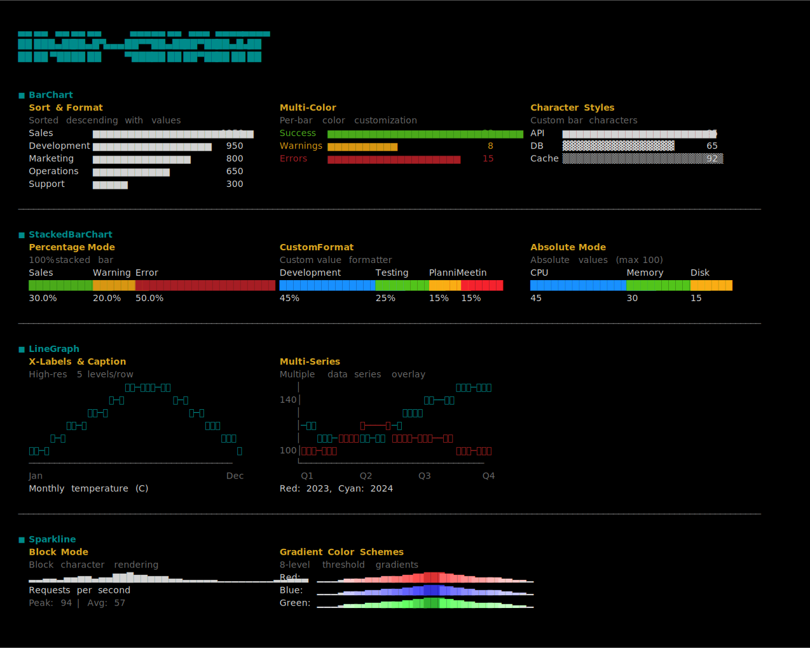

# ink-chart

Terminal visualization components for [Ink](https://github.com/vadimdemedes/ink), React CLI framework

## Preview



## Features

- **BarChart** - Horizontal bar charts with individual row coloring and custom formatting
- **StackedBarChart** - 100% stacked horizontal bar charts showing percentage distribution
- **LineGraph** - High-resolution line graphs with multi-series support and axis labels
- **Sparkline** - Compact trend visualization with threshold highlighting and gradient colors
- **TypeScript** - Full TypeScript support with comprehensive type definitions
- **Auto-width** - Responsive charts that adapt to terminal width
- **Gradient Colors** - 8-level smooth color gradients with automatic terminal compatibility
- **Performance** - Optimized rendering with React.memo to prevent flickering

## Installation

```bash
npm install @pppp606/ink-chart
```

## Quick Start

```tsx
import React from 'react';
import { render, Text, Box } from 'ink';
import { BarChart, StackedBarChart, LineGraph, Sparkline } from '@pppp606/ink-chart';

function App() {
  return (
    <Box flexDirection="column">
      {/* Bar chart with values */}
      <BarChart
        data={[
          { label: 'Sales', value: 1250 },
          { label: 'Marketing', value: 800 }
        ]}
        showValue="right"
        sort="desc"
      />

      {/* Stacked bar chart showing distribution */}
      <StackedBarChart
        data={[
          { label: 'Complete', value: 75, color: '#4aaa1a' },
          { label: 'Remaining', value: 25, color: '#d89612' }
        ]}
      />

      {/* Line graph with multiple series */}
      <LineGraph
        data={[
          { values: [10, 15, 12, 18, 14, 20], color: 'red' },
          { values: [8, 12, 16, 14, 18, 16], color: 'blue' }
        ]}
        height={5}
        showYAxis={true}
        xLabels={['Jan', 'Jun']}
      />

      {/* Simple sparkline */}
      <Sparkline data={[1, 3, 2, 5, 4, 6, 3]} />
    </Box>
  );
}

render(<App />);
```

## Components

### BarChart

Horizontal bar charts with customizable appearance and individual row colors.

```tsx
<BarChart
  data={[
    { label: 'Success', value: 22, color: '#4aaa1a' },
    { label: 'Warnings', value: 8, color: '#d89612' },
    { label: 'Errors', value: 15, color: '#a61d24' }
  ]}
  showValue="right"
  width={50}
  format={(v) => `${v}%`}
/>
```

Output:
```
Success  ████████████████████████████████████████████████████████████████████ 22%
Errors   ▓▓▓▓▓▓▓▓▓▓▓▓▓▓▓▓▓▓▓▓▓▓▓▓▓▓▓▓▓▓▓▓▓▓▓▓▓▓▓▓▓▓▓▓▓▓▓ 15%
Warnings ▒▒▒▒▒▒▒▒▒▒▒▒▒▒▒▒▒▒▒▒▒▒▒▒▒ 8%
```

**Props:**
- `data: BarChartData[]` - Array of data points
- `sort?: 'none' | 'asc' | 'desc'` - Sort order
- `showValue?: 'right' | 'inside' | 'none'` - Value display position
- `width?: 'auto' | 'full' | number` - Chart width (`'auto'`: natural content width, `'full'`: terminal width, `number`: fixed width)
- `max?: 'auto' | number` - Maximum value for scaling
- `format?: (value: number) => string` - Value formatter
- `barChar?: '▆' | '█' | '▓' | '▒' | '░'` - Bar character
- `color?: string` - Default color (overridden by individual `BarChartData.color`)

**BarChartData interface:**
```tsx
interface BarChartData {
  label: string;
  value: number;
  color?: string; // Hex code or Ink color name
}
```

### StackedBarChart

Stacked horizontal bar chart with two modes: 100% percentage distribution or absolute values.

```tsx
<StackedBarChart
  data={[
    { label: 'Sales', value: 30, color: '#4aaa1a' },
    { label: 'Warning', value: 20, color: '#d89612' },
    { label: 'Error', value: 50, color: '#a61d24' }
  ]}
  width={50}
/>
```

Output:
```
Sales          Warning   Error
███████████████▓▓▓▓▓▓▓▓▓▓▒▒▒▒▒▒▒▒▒▒▒▒▒▒▒▒▒▒▒▒▒▒▒▒▒
30.0%          20.0%     50.0%
```

**Props:**
- `data: StackedBarSegment[]` - Array of segments to display
- `mode?: 'percentage' | 'absolute'` - Display mode (default: `'percentage'`)
  - `'percentage'`: 100% stacked showing percentage distribution
  - `'absolute'`: Stacked bar showing actual values scaled to max
- `max?: 'auto' | number` - Maximum value for scaling in absolute mode (default: `'auto'`)
- `width?: 'auto' | 'full' | number` - Chart width (`'auto'`: 40 characters default, `'full'`: terminal width, `number`: fixed width)
- `showLabels?: boolean` - Whether to show segment labels above bar (default: `true`)
- `showValues?: boolean` - Whether to show values below bar (default: `true`)
- `format?: (value: number, mode: StackedBarChartMode) => string` - Value formatter

**StackedBarSegment interface:**
```tsx
interface StackedBarSegment {
  label: string;
  value: number;
  color?: string; // Hex code or Ink color name
  char?: string;  // Custom character for this segment
}
```

### LineGraph

High-resolution line graph using Unicode scan line characters (⎺ ⎻ ─ ⎼ ⎽) for 5-level vertical resolution per row.

```tsx
<LineGraph
  data={[
    { values: [100, 120, 115, 130, 125, 140], color: 'red' }
  ]}
  width={50}
  height={6}
  showYAxis={true}
  xLabels={['Q1', 'Q4']}
/>
```

Output:
```
   140│                    ⎽─⎺
      │              ⎽─⎺⎻─⎻
      │          ⎽⎼─⎺
      │    ⎽─⎺⎻─⎻
      │⎽⎼─⎺
   100│⎺
      └──────────────────────
       Q1                  Q4
```

**Props:**
- `data: LineGraphSeries[]` - Array of data series (each with `values` and optional `color`)
- `width?: 'auto' | 'full' | number` - Chart width
- `height?: number` - Chart height in rows (default: 10, each row = 5 vertical levels)
- `yDomain?: 'auto' | [number, number]` - Y-axis range
- `showYAxis?: boolean` - Show Y-axis labels (default: false)
- `yLabels?: (string | number)[]` - Custom Y-axis labels (numbers: position-based, strings: evenly distributed)
- `xLabels?: (string | number)[]` - X-axis labels (numbers: position-based, strings: evenly distributed)
- `caption?: string` - Optional caption below chart

**LineGraphSeries interface:**
```tsx
interface LineGraphSeries {
  values: number[];
  color?: string; // Ink color name or hex
}
```

### Sparkline

Compact trend visualization perfect for displaying time series data.

```tsx
<Sparkline
  data={[1, 3, 2, 8, 4]}
  width={30}
  threshold={5}
  colorScheme="red"
  caption="Sales Trend"
/>
```

Output:
```
▂▄▃█▅
Sales Trend
```

**Props:**
- `data: number[]` - Array of numeric values
- `width?: 'auto' | 'full' | number` - Chart width (`'auto'`: data length, `'full'`: terminal width, `number`: fixed width)
- `threshold?: number | number[]` - Threshold(s) for highlighting (single or gradient)
- `colorScheme?: 'red' | 'blue' | 'green'` - Color scheme for gradient highlighting
- `mode?: 'block' | 'braille'` - Rendering mode
- `caption?: string` - Optional caption below chart

## Advanced Features

### Smooth Color Gradients

8-level gradient highlighting with automatic terminal compatibility:

```tsx
<Sparkline 
  threshold={[10, 20, 30, 40, 50, 60, 70, 80]}
  colorScheme="blue" // red, blue, or green
/>
```

**Color Support:**
- **24-bit terminals** (iTerm, VSCode): Full RGB gradients
- **256-color terminals**: Palette-based gradients
- **16-color terminals**: Basic color fallbacks

Detection is automatic based on `COLORTERM`, `TERM`, and `TERM_PROGRAM` environment variables.

### Performance Optimization

Components are optimized with `React.memo` to prevent unnecessary re-renders:

```tsx
// Only re-renders when values actually change
<BarChart data={dynamicData} />
```

### Full-width Support

Charts can adapt to full terminal width:

```tsx
<Sparkline width="full" /> // Full terminal width
<BarChart width="full" />  // Full terminal width
```

## Security

This package implements comprehensive security practices:

- **Secure CI/CD**: SHA-pinned GitHub Actions with minimal permissions
- **Supply Chain Protection**: Provenance attestation and OIDC authentication
- **Secret Scanning**: Automated detection of accidentally committed secrets
- **Dependency Security**: Regular security audits and automated vulnerability scanning
- **Workflow Protection**: CODEOWNERS file and branch protection rules

For security policy, vulnerability reporting, and detailed security information, see [SECURITY.md](SECURITY.md).

## License

MIT